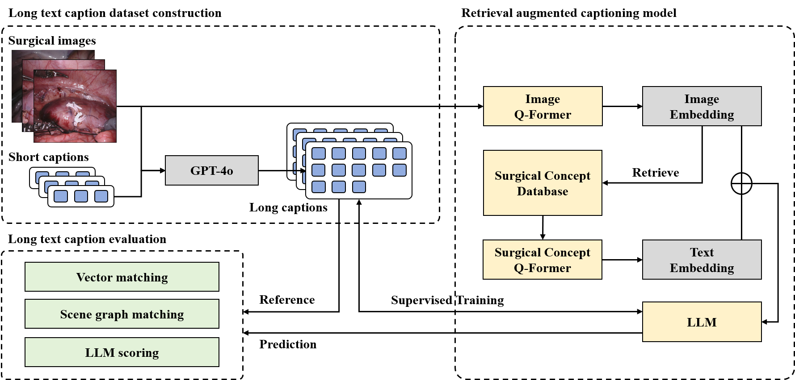

<!--
 * @Description: 
 * @Version: 1.0
 * @Autor: ZhuYichen
 * @Date: 2025-02-14 12:54:36
 * @LastEditors: ZhuYichen
 * @LastEditTime: 2025-02-26 14:44:19
-->
## Long-text Caption Generation for Surgical Image with A Concept Retrieval Augmented Large Multimodal Model

> Surgical image captioning automatically generates captions for surgical images, aiding in understanding procedures and supporting both real-time instruction and post-operative reports. Current methods for surgical image captioning often rely on brief caption data, with the generated captions primarily extracting surgical triplets from the images. Consequently, these methods fail to sufficiently capture the complex scenes and interactions inherent in surgical images. To address this issue, we first design an automated method for constructing a long-text caption dataset for surgical images, extending the EndoVis2018 dataset. At the model level, we propose a retrieval-augmented model for generating long-text captions of surgical images. Specifically, we introduce a surgical concept vector database and utilize cross-attention within the Q-Former module to incorporate surgical concepts, directing the model to focus on key features within the surgical images. Finally, we optimize and refine a set of semantic evaluation metrics to enhance their suitability for assessing long-text captioning models. Experiment results demonstrate that our proposed surgical concept retrieval-augmented large multimodal
model effectively generates long-text captions for surgical images. Furthermore, the evaluation metrics introduced for long-text caption evaluation significantly outperform traditional metrics in terms of correlation with human judgment.

<div align=center></div>


## Setup
Install the required packages using conda with the provided [environment.yaml](environment.yaml) file.

## Data
Download the long-text caption dataset from [EndoVis2018LongCap](https://huggingface.co/datasets/liujiquan/EndoVis2018LongCap).
Save the data in ./data/miccai_coco.

## Database
You can use /ext_data/ext_memory_miccai_new.pkl as the vector database. Or build custom vector database for retrieval:
```bash
python vector_database.py
```

## Train
Train on the MICCAI training dataset:
```bash
CUDA_VISIBLE_DEVICES="0,1,2,3" python train.py --out_dir results/train
```

## Inference
Inference on the MICCAI val set:
```bash
python eval_model.py --device cuda:0 \
--name_of_datasets miccai \
--path_of_val_datasets data/miccai_coco/annotations/val.json \
--image_folder data/miccai_coco/val/ \
--out_path generated_captions \
```

## Evaluate
Evaluate the inference results.
Traditional metrics and Weighted-BERTScore:
```bash
python score.py
```
CLAIR:
```bash
python evaluate_clair.py
```
Long-SPICE:
```bash
python rte/rte.py
python rte/score.py
```

## Acknowledgements
This repo is built on [EVCap](https://github.com/Jiaxuan-Li/EVCap), we thank the authors for their great effort.

